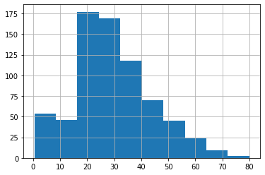
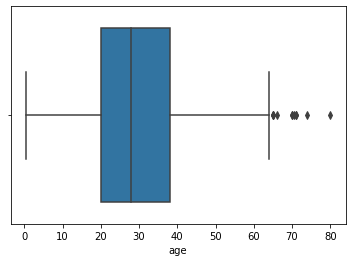
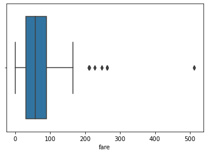
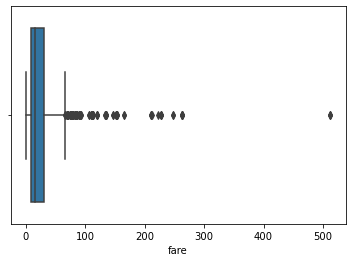

# <center>STATS TESTS IN PYTHON</center>
### By: Yasirkhana
### Email: Khan10055yasir@gmail.com

# 1. Shapiro Wilk Test
- Tests wheather a data sample has a Gaussian distribution

#### ASSUMPTIONS:
    -Observations in each step are independent and identically distributed (iid).
    -Interpretaion 


 - H0 = This sample has a Gaussian distribution
 - H1 = This sample does not have a Gaussian/Normal distribution


```python
# installing scipy lib
!pip install scipy 
```

    Requirement already satisfied: scipy in e:\anaconda\lib\site-packages (1.6.2)
    Requirement already satisfied: numpy<1.23.0,>=1.16.5 in e:\anaconda\lib\site-packages (from scipy) (1.20.1)
    


```python
# importing lib
from scipy.stats import shapiro
```


```python
data = [0.873, 2.817, 0.121, -0.945, -0.055, -1.436, 0.360, -1.478, -1.637, -1.869] 
shapiro(data)
# as pvalue(1.062) is great then 0.05 so this value is not cosiderable 
# 0.05 is threshold
```


    ShapiroResult(statistic=0.8951009511947632, pvalue=0.19340917468070984)


```python
stat, p = shapiro(data)
print(f'stat = {stat} , p = {p}')

if p > 0.05:
    print('The data is Normal or Gaussian')
else:
    print('The data is not Normal')

```

    stat = 0.8951009511947632 , p = 0.19340917468070984
    The data is Normal or Gaussian
    

## Now we will impliment the test on titanic data set.


```python
# importing libraires
import numpy as np
import pandas as pd
import matplotlib.pyplot as plt
import seaborn as sns
```


```python
titanic = sns.load_dataset('titanic')
 
titanic['age'].hist() 
```


    <AxesSubplot:>


    

    


```python
sns.boxplot(titanic['age'])
```

    E:\Anaconda\lib\site-packages\seaborn\_decorators.py:36: FutureWarning: Pass the following variable as a keyword arg: x. From version 0.12, the only valid positional argument will be `data`, and passing other arguments without an explicit keyword will result in an error or misinterpretation.
      warnings.warn(
    


    <AxesSubplot:xlabel='age'>


    

    


## Normality Test


```python
# using same above code
stat, p = shapiro(titanic['age'])
print(f'stat = {stat} , p = {p}')

if p > 0.05:
    print('The data is Normal or Gaussian')
else:
    print('The data is not Normal')


```

    stat = nan , p = 1.0
    The data is Normal or Gaussian
    


```python
    
# using same above code
# droping empty value
titanic = titanic.dropna()

stat, p = shapiro(titanic['fare'])
print(f'stat = {stat} , p = {p}')

if p > 0.05:
    print('The data is Normal or Gaussian')
else:
    print('The data is not Normal')
    
    
sns.boxplot(titanic['fare'])


```

    stat = 0.7430527806282043 , p = 1.6486823985903073e-16
    The data is not Normal
    

    E:\Anaconda\lib\site-packages\seaborn\_decorators.py:36: FutureWarning: Pass the following variable as a keyword arg: x. From version 0.12, the only valid positional argument will be `data`, and passing other arguments without an explicit keyword will result in an error or misinterpretation.
      warnings.warn(
    


    <AxesSubplot:xlabel='fare'>


    

    


```python
# After removing empty values, we can see that the box is equally divided means data is normal
sns.boxplot(titanic['age'])
```

    E:\Anaconda\lib\site-packages\seaborn\_decorators.py:36: FutureWarning: Pass the following variable as a keyword arg: x. From version 0.12, the only valid positional argument will be `data`, and passing other arguments without an explicit keyword will result in an error or misinterpretation.
      warnings.warn(
    


    <AxesSubplot:xlabel='age'>


    

    


```python
 titanic['age'].hist() 
```


    <AxesSubplot:>


    

    


```python
# Testing for titanic['fare'] column
# using same above code
stat, p = shapiro(titanic['fare'])
print(f'stat = {stat} , p = {p}')

if p > 0.05:
    print('The data is Normal or Gaussian')
else:
    print('The data is not Normal')
    
    
sns.boxplot(titanic['fare'])


# So the data is not normal here.
```

    stat = 0.5218914747238159 , p = 1.0789998175301091e-43
    The data is not Normal
    

    E:\Anaconda\lib\site-packages\seaborn\_decorators.py:36: FutureWarning: Pass the following variable as a keyword arg: x. From version 0.12, the only valid positional argument will be `data`, and passing other arguments without an explicit keyword will result in an error or misinterpretation.
      warnings.warn(
    


    <AxesSubplot:xlabel='fare'>


    

    


# 2- CORRELATION TEST
## 2.1 - PEARSON'S CORRELATION COEFFICIENT  
- Test wheather two samples have a linear relationship
##### ASSUMTIONS:
    1. Obersation in each sample are independent and identically distributed
    2. Obersation in each sample are normally distributed.
    3. Obersation in each sample have the same varience
    4. Interpretation

- H0 = The two samples are independent.
- H1 = There is a dependency between the samples.


```python
# Example of Pearson's correlation test:
from scipy.stats import pearsonr 
data1 = [0.873, 2.817, 0.121, -0.945, -0.055, -1.436, 0.360, -1.478, -1.637, -1.869] 
data2 = [0.253, 3.517, 0.125, -7.545, -0.555, -1.536, 3.350, -1.578, -3.537, -1.579] 

stat, p = pearsonr(data1,data2)

print(f'stat = {stat} , p = {p}')

if p > 0.05:
    print('Propably independent (No correlation)')
else:
    print('Propably dependent (correlation Exists)')
```

    stat = 0.6860166341568066 , p = 0.028501975029885156
    Propably dependent (correlation Exists)
    


```python
# Appling pearson's on titanic dataset
titanic = titanic.dropna()

stat, p = pearsonr(titanic['age'],titanic['fare'])

print(f'stat = {stat} , p = {p}')

if p > 0.05:
    print('Propably independent (No correlation)')
else:
    print('Propably dependent (correlation Exists)')
```

    stat = -0.09073036394094937 , p = 0.223185916258614
    Propably independent (No correlation)
    

# 2- CORRELATION TEST
## 2.2 - PEARSON'S CORRELATION COEFFICIENT  
- Test wheather two samples have monotonic relationship
##### ASSUMTIONS:
    1. Obersation in each sample are independent and identically distributed
    2. Obersation in each sample can be ranked.
    3. Interpretation

- H0 = The two samples are independent.
- H1 = There is a dependency between the samples.


```python
# Example of Spearsan's Rnak correlation test:
from scipy.stats import spearmanr 
data1 = [0.873, 2.817, 0.121, -0.945, -0.055, -1.436, 0.360, -1.478, -1.637, -1.869] 
data2 = [0.253, 3.517, 0.125, -7.545, -0.555, -1.536, 3.350, -1.578, -3.537, -1.579] 

stat, p = spearmanr(data1,data2)

print(f'stat = {stat} , p = {p}')

if p > 0.05:
    print('Propably independent (No correlation)')
else:
    print('Propably dependent (correlation Exists)')
```

    stat = 0.8545454545454544 , p = 0.0016368033159867143
    Propably dependent (correlation Exists)
    


```python
# Appling Spearsan's Rnak correlation test on titanic dataset
titanic = titanic.dropna()

stat, p = spearmanr(titanic['age'],titanic['fare'])

print(f'stat = {stat} , p = {p}')

if p > 0.05:
    print('Propably independent (No correlation)')
else:
    print('Propably dependent (correlation Exists)')
```

    stat = -0.07258447372826443 , p = 0.3301774806884409
    Propably independent (No correlation)
    

# 3- Chi- Squared Test
- Test wheather two categorical values are related or independent
##### ASSUMTIONS:
    1. Obervation used in the calculation of the contingency table are independent. 25 or more examples in each cell of the contingency table. Interpretation

- H0 = The two samples are independent.
- H1 = There is a dependency between the samples.


```python
#Example of Chi-squared test
from scipy.stats import chi2_contingency
table = [[10,20,30],[6,9,17]]
stat , p , dof, expected = chi2_contingency(table)
print(f'stat = {stat} , p = {p}')

if p > 0.05:
    print('Propably Independent ')
else:
    print('Propably Dependent ')
```

    stat = 0.27157465150403504 , p = 0.873028283380073
    Propably Independent 
    

# 4- PARAMETRIC STATISTICAL HYPOTHESIS TESTS

## 4.1 - STUDENT T-TEST

- Test wheather the mean of two independent samples significantly different.
##### ASSUMTIONS:
    1. Obersation in each sample are independent and identically distributed(iid)
    2. Obersation in each sample are normally distributed.
    3. Obersation in each sample have the same variance.
    4. Interpretation

- H0 = The two samples are independent.
- H1 = There is a dependency between the samples.


```python
# Example of student t-test:
from scipy.stats import ttest_ind
data1 = [0.873, 2.817, 0.121, -0.945, -0.055, -1.436, 0.360, -1.478, -1.637, -1.869] 
data2 = [0.253, 3.517, 0.125, -7.545, -0.555, -1.536, 3.350, -1.578, -3.537, -1.579] 

stat, p = ttest_ind(data1,data2)

print(f'stat = {stat} , p = {p}')

if p > 0.05:
    print('Propably the same distribution')
else:
    print('Propably different distribution')
```

    stat = 0.5240705222477275 , p = 0.606623179638818
    Propably the same distribution
    


```python
# Example of student t-test on Titanic dataset:

stat, p = ttest_ind(titanic['age'],titanic['fare'])
print(f'stat = {stat} , p = {p}')

if p > 0.05:
    print('Propably the same data set')
else:
    print('Propably different data set')
```

    stat = -7.480848976059225 , p = 5.64656168773021e-13
    Propably different data set
    

# 4- PARAMETRIC STATISTICAL HYPOTHESIS TESTS

## 4.2 - PAIRED STUDENT'S T-TEST

- Test wheather the mean of two paired samples significantly different.
##### ASSUMTIONS:
    1. Obersation in each sample are independent and identically distributed(iid)
    2. Obersation in each sample are normally distributed.
    3. Obersation in each sample have the same variance.
    4. Obersation across each sample are paired.
    5. Interpretation

- H0 = The two samples are independent.
- H1 = There is a dependency between the samples.


```python
# Example of paired student t-test:
from scipy.stats import ttest_rel
data1 = [0.873, 2.817, 0.121, -0.945, -0.055, -1.436, 0.360, -1.478, -1.637, -1.869] 
data2 = [0.253, 3.517, 0.125, -7.545, -0.555, -1.536, 3.350, -1.578, -3.537, -1.579] 

stat, p = ttest_rel(data1,data2)

print(f'stat = {stat} , p = {p}')

if p > 0.05:
    print('Propably the same distribution')
else:
    print('Propably different distribution')
```

    stat = 0.7538941100656114 , p = 0.4701760059321177
    Propably the same distribution
    

# 5- ANALYSIS OF VARIANCE TESTS (ANOVA)

- Test wheather the mean of two independent samples are significantly different.
##### ASSUMTIONS:
    1. Obersation in each sample are independent and identically distributed(iid)
    2. Obersation in each sample are normally distributed.
    3. Obersation in each sample have the same variance.
    4. Interpretation

- H0 = The two samples are independent.
- H1 = There is a dependency between the samples.


```python
# Example of Analysis of variance test:
from scipy.stats import f_oneway # One way anova
data1 = [0.873, 2.817, 0.121, -0.945, -0.055, -1.436, 0.360, -1.478, -1.637, -1.869] 
data3 = [0.453, 5.867, 1.151, -0.641, -0.825, -5.436, 0.110, -1.968, -3.521, -1.110] 
data2 = [0.253, 3.517, 0.125, -7.545, -0.555, -1.536, 3.350, -1.578, -3.537, -1.579] 

stat, p = f_oneway(data1,data2,data3)

print(f'stat = {stat} , p = {p}')

if p > 0.05:
    print('Propably the same distribution')
else:
    print('Propably different distribution')
```

    stat = 0.11989260052594301 , p = 0.8874852720918347
    Propably the same distribution
    
